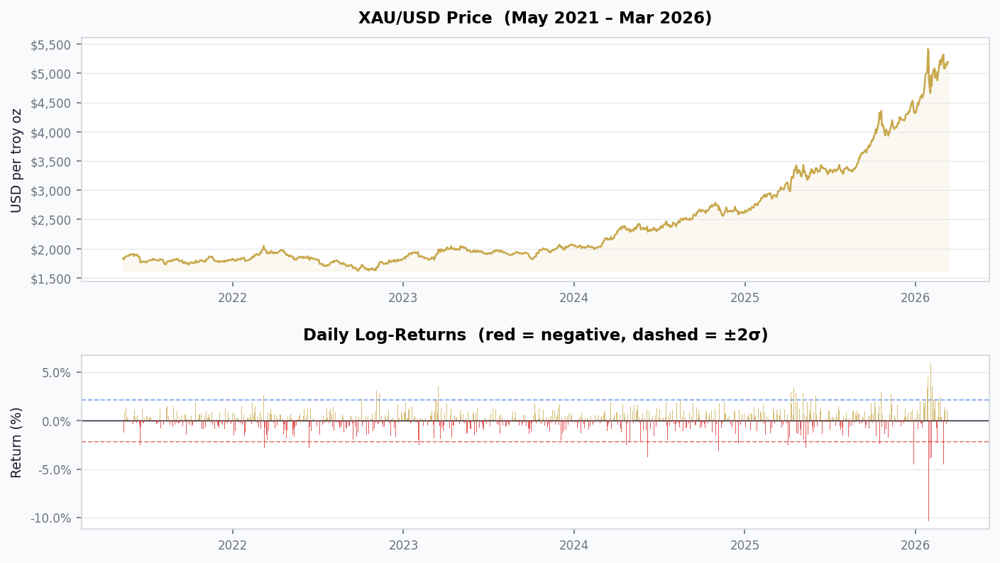
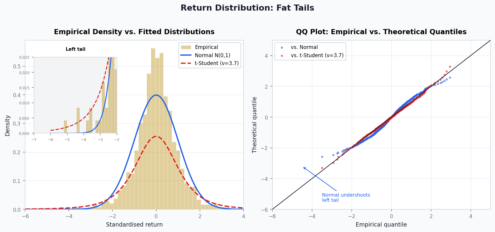
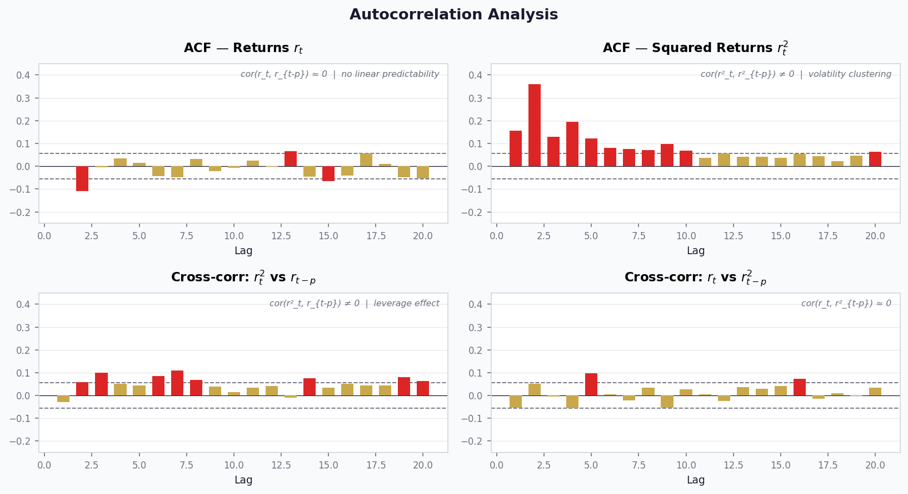

# Gold (XAU/USD) Return Distribution & Risk Analysis in R

> This project applies code and methodology developed in the course **Modelling Financial Risk with R**, taught by dr Michał Rubaszek at SGH Warsaw School of Economics (2026). The R scripts are adapted from course materials. Analysis and interpretation are applied independently to XAU/USD data.

An end-to-end analysis of daily gold price returns using R, covering data collection, distributional modelling, fat-tail testing, and volatility structure characterisation.

## Motivation

Gold is one of the most actively traded assets globally, serving simultaneously as a commodity, a currency hedge, and a safe-haven instrument. Its return distribution is known to deviate significantly from normality, which is a critical concern for anyone building risk models. This project investigates how those deviations manifest in recent data (2021 to 2026) and what statistical tools best capture them.

## Key Results

| Metric | Value |
|---|---|
| Sample period | May 2021 to March 2026 |
| Observations | 1,250 daily returns |
| Annualised return | **+20.78%** |
| Annualised volatility | **16.95%** |
| Skewness | **-0.82** (left-skewed) |
| Kurtosis | **12.47** (normal = 3) |
| Jarque-Bera p-value | **< 0.0001** |
| Worst single day | **-10.39%** |
| Best single day | **+5.95%** |

> **Bottom line:** Gold returns over this period show strong evidence of fat tails (kurtosis = 12.47 vs. 3 for normal) and negative skewness, meaning large losses occur more frequently and are more extreme than a normal distribution would predict. This has direct implications for VaR and portfolio risk models.

## Charts

**Price and daily returns (2021 to 2026).** Red bars are negative return days. Dashed lines mark the ±2σ threshold.



**Return distribution.** The histogram of standardised returns sits noticeably wider than the normal curve (blue), while the t-Student fit (red, ν = 3.7) tracks the tails more closely. The inset zooms into the left tail where the difference is most consequential for risk measurement.



**Autocorrelation structure.** Red bars exceed the 95% confidence band. Returns themselves show no significant autocorrelation (top-left), but squared returns do across many lags (top-right), confirming volatility clustering. The cross-correlation panels reveal a leverage effect: past negative returns predict higher future volatility.



## Project Structure

```
├── xauusd.csv                        # Historical XAU/USD daily closing prices (Stooq)
├── LoadFundData.R                    # Data loading and log-return computation
├── MRFzR_Topic2.R                    # Main analysis script
├── images/
│   ├── chart1_price_returns.png      # Price level and daily return bars
│   ├── chart2_distribution.png       # Density + QQ plot
│   └── chart3_acf.png                # ACF / cross-correlation panel
└── README.md
```

## Analysis Pipeline

### 1. Data Collection

Price data is downloaded from [Stooq.pl](https://stooq.pl/q/?s=xauusd) via a simple CSV request. The script extracts closing prices, constructs a `zoo` time-series object, and computes daily log-returns:

```r
P <- zoo(y$Price, order.by = as.Date(y$Dates))
r <- diff(log(P))
```

Log-returns are used throughout because they are **additive across time** and **symmetric around zero**, properties that make them better suited for statistical modelling than simple percentage returns.

### 2. Descriptive Statistics

All four distributional moments are computed from scratch and cross-validated using the `moments` package:

```r
mu  <- sum(R) / N                     # mean
sig <- sqrt(sum((R - mu)^2) / N)      # standard deviation
S   <- sum((R - mu)^3) / (N * sig^3)  # skewness
K   <- sum((R - mu)^4) / (N * sig^4)  # kurtosis
```

Annualisation follows the Square Root of Time rule (250 trading days), the standard approach in risk reporting under Basel II/III:

```r
muA  <- mu  * 250          # annualised return
sigA <- sig * sqrt(250)    # annualised volatility
```

### 3. Fat-Tail Testing

Three formal normality tests are applied to detect departures from the Gaussian assumption:

| Test | Null hypothesis | Result (XAU/USD) |
|---|---|---|
| D'Agostino | Skewness = 0 | **Rejected** (S = -0.82) |
| Anscombe-Glynn | Kurtosis = 3 | **Rejected** (K = 12.47) |
| Jarque-Bera | S = 0 and K = 3 jointly | **Rejected** (p < 0.0001) |

All three tests reject normality, consistent with the well-known stylised fact that financial returns have **fat tails**.

### 4. t-Student Distribution Fitting

To model the fat-tailed behaviour, a t-Student distribution is fitted to standardised returns using Maximum Likelihood Estimation via `fitdistr` from the `MASS` package. A method-of-moments estimate provides the starting value:

```r
v0 <- 4 + 6 / (K - 3)   # method of moments starting value

d1 <- fitdistr(R0, "t", m = 0,
               start = list(s = sqrt((v0-2)/v0), df = v0),
               lower = c(0.001, 3))
```

The estimated degrees of freedom determines how fat the tails are. Lower values mean heavier tails. For gold over this period the estimate is consistent with typical financial assets, at approximately 4 to 5 degrees of freedom.

### 5. QQ Plots

Quantile-quantile plots compare empirical quantiles of standardised returns against the normal and t-Student distributions. Deviations from the 45° line under the normal QQ plot confirm fat-tail behaviour, while the t-Student QQ plot shows substantially better alignment, especially in the extreme quantiles that matter most for risk management.

### 6. Autocorrelation and Volatility Clustering

ACF and cross-correlation plots investigate four relationships central to financial time-series modelling:

```r
acf(R)      # returns vs lagged returns     → expect ≈ 0
acf(R^2)    # squared returns vs lagged     → expect ≠ 0 (clustering)
ccf(R^2, R) # cross-correlations            → leverage effect
```

The Ljung-Box test then formalises these observations:

```r
Box.test(R,   lag = 4, type = "Ljung-Box")   # on returns
Box.test(R^2, lag = 4, type = "Ljung-Box")   # on squared returns
```

Returns show no significant autocorrelation, but squared returns do, confirming **volatility clustering** (large moves tend to follow large moves). This is the key empirical motivation for GARCH-type models in subsequent analysis.

## What This Analysis Shows

**Normal distribution is inadequate for gold risk modelling.** With kurtosis of 12.47 and a worst daily loss of -10.39%, a Gaussian VaR model would systematically underestimate tail risk. The t-Student distribution provides a better fit, capturing the heavy tails that matter most for Value-at-Risk and Expected Shortfall calculations. Beyond the distributional shape, volatility is not constant, as significant autocorrelation in squared returns points to volatility clustering, which is a key input for dynamic risk models such as EWMA and GARCH. The Square Root of Time rule provides a practical bridge between daily risk estimates and the longer horizons required under Basel II/III reporting.

## Next Steps

Three workstreams extend this analysis toward a full risk measurement framework. First, compute VaR and Expected Shortfall using four methods (Normal, t-Student, historical simulation, and Cornish-Fisher) to quantify how much the distributional assumption affects risk estimates. Second, fit a GARCH(1,1) model to capture time-varying volatility and produce conditional risk forecasts. Third, backtest all models using Kupiec and Christoffersen tests to assess which best holds up against realised returns.

## Requirements

```r
install.packages(c("zoo", "ggplot2", "rugarch", "moments", "MASS", "tseries"))
```

R version 4.x or higher recommended.

## Data Source

XAU/USD daily closing prices from [Stooq.pl](https://stooq.pl/q/?s=xauusd). To refresh the data, set `CreFile = TRUE` in `LoadFundData.R`.
